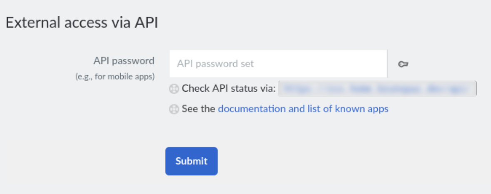

# Fresh RSS Cleaner

> A command line tool to mark as read [FreshRSS](https://www.freshrss.org/) feeds and categories, based on time.

[](https://github.com/brpaz/freshrss-cleaner/actions/CI.yml)
[](LICENSE)

[](https://goreportcard.com/report/github.com/brpaz/freshrss-cleaner)

## 🎯 Motivation

I use FreshRSS extensively as my main source of News.

For some particular sources, like newspapers, those feeds can get outdated quickly. While Fresh RSS has some options to manage the archival of older feeds, I couldn´t get it to work exactly as I would like, which is simply mark as read articles older than a particular time, configurable by Feed or Category.

That´s when I decided to build this simply tool and run it on schedule to cleanup my FreshRSS instance.

## Getting Started

### Pre-Requisites

- FreshRSS instance with API Access Enabled.
  - To enable your API access, go to `https://myfreshrss.com/i/?c=user&a=profile` and set a password in the field `External access via API`.
  - You will need this password and your username, to authenticate in the FreshRSS API.



### Installation

This tool is packaged as a single binary, so the simplest way is to download the latest [Release](https://github.com/brpaz/freshrss-cleaner/releases).

Alternatively, a Docker image is also provided.

### Usage

#### Generate a config file

A `freshrss-cleaner.yaml` file is required in order to configure the rules for your feeds.

You can use the `freshrss-cleaner create-config` command to create a basic config file in your User Config directory. (Ex: On linux ~/.config/freshrss-cleaner.yaml`).

Alternatively, you can pass the `--config` file when running the tool.

```sh
freshrss-cleaner clean --config="/path/to/my/config/yaml"
```

The config file should contain the following:

```yaml
url: "https://myinstance.com/api/greader.php"
username: "<freshrss_username"
password: "<freshrss_password_or_api_key>"
feeds:
  - id: "feed/22"
    days: 2
  - id: "user/-/label/DevOps"
    days: 5
```

The config file support environment variables substitution. For example, if you want to set your credentials from envrionment variables, you can set the following in your config:

```yaml
url: env("FRESHRSS_URL")
username: env("FRESHRSS_USER")
password: env("FRESHRSS_PASSWORD")
```

### Configure your feed cleanup rules

On your `feeds` array, you can configure the feeds that will be processed.

- `id` this is the id of the feed or category.
- `days` the number of days, to delete old feeds. (older than specified days)

For the `id` field, you can use any format supported by the FreshRSS API.

For a specific feed, open the feed on your FreshRSS instance. You will see an URL like `https://myinstance/i/?get=f_248`. The id to use is the `248` (without the `f`)

For entire categories or tags, you can use an expression like `user/-/label/DevOps` as ID. this will process articles from the category `DevOps` independent of the feed. You can check the logic behind FreshRSS API at: https://github.com/FreshRSS/FreshRSS/blob/d0b961131939800a119801bfce7411ad2e429e9e/p/api/greader.php#L939


## 🤝 Contributing

Check [CONTRIBUTING.md](CONTRIBUTING.md) files for details.

## 🫶 Support

If you find this project helpful and would like to support its development, there are a few ways you can contribute:

[](https://github.com/sponsors/brpaz)

<a href="https://www.buymeacoffee.com/Z1Bu6asGV" target="_blank"></a>


## 📃 License

Distributed under the MIT License. See [LICENSE](LICENSE) file for details.

## 📩 Contact

✉️ **Email** - [oss@brunopaz.dev](oss@brunopaz.dev)

🖇️ **Source code**: [https://github.com/brpaz/freshrss-cleaner](https://github.com/brpaz/freshrss-cleaner)


